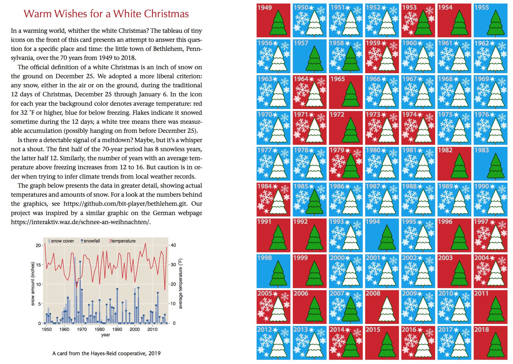

# bethlehem
2019 holiday card data

This repository archives data on white Christmases in Bethlehem, Pennsylvania. The data formed the basis of a holiday card prepared for 2019.

The point of the project was to look at weather data for the Christmas season at one location, over several decades, to see if any climatic trends might be visible. The chosen place was Bethlehem, Pennsylvania, where the average temperature at this time of year is reasonably close to the freezing point. Thus a small change in temperature might conceivably have a noticeable effect on whether precipitation falls as rain or snow.

We draw no firm conclusions about the outcome. The following paragraphs explain where the data came from, and how it was marshalled to produce a tableau of year-by-year icons and a graph covering the 70 yers from 1949 through 2018.

##Data Downloading

The weather data were downloaded from the [National Centers for Environmental Information](https://www.ncdc.noaa.gov/cdo-web/), a service of NOAA, the National Oceanic and Atmospheric Administration. I have not found a way to access the NOAA database programmatically; I had to fill out a [web form](https://www.ncdc.noaa.gov/cdo-web/search?datasetid=GHCND) by hand. My selections were based on the following protocol:
	
* For the four items on the first page of the form:
	
	* Select "Daily Summaries"
	* Enter a date range (see below for more detail)
	* Select "Stations"
	* Enter "USW00014737" (This is the designator for Allentown Lehigh Valley International Airport, the closest weather station with long-term data.)
	* Press the "Search" button

* You should now see a map showing the location of the selected weather station. In the upper left, press the "Add to Cart" button. (It's a shopping cart, but there's no charge.)

* In the upper right corner of the map you should now see a brown button with the legend "Cart(Free Data) 1 item". Click on it.

* You will now be taken to the second page of the web form, where you choose data formats. I recommend "Custom GHCN-Daily CSV," although you are welcome to experiment with the other options. Your selected date range should be shown in the panel below. Press "Continue."

* Page 3. The options at the top of the page will make the downloaded file more verbose in various ways. I chose to include the station name but not the other options. The data items in the lower panel are important. I selected all three precipitation variables and all three temperature variables, but not others.

* Page 4. Review your selections and enter an email address, and press "Submit."

* Watch for two emails, the first acknowledging the submission, the second including a download link. I generally didn't have to wait more than a minute or two for the second email (except during the three weeks in late November and early December when the entire service was offline).

Boy, that's a lot of rigmarole just get your hands on 3 megabytes of data. Worse, you're going to have to repeat that routine at least seven times to get 70 years worth of data. The website will not let you download more than 10 years at a time -- although it may not tell you that until it sends the error message in the email.

I find it ridiculous in 2019 that data of such obvious interest are not more easily accessible. Maybe I just didn't find the right door to knock on. If anyone knows a better way, please let me know.

## Data Wrangling

[ More to come ]

